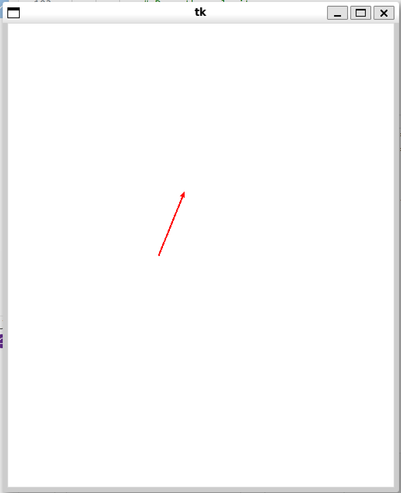

# Funny Mouse Pointer Prediction using Kalman Filter

This is a fun Python application that tracks your mouse pointer in real time and uses a Kalman filter to predicts where it's going to move next. The program smooths the noisy pointer data and predicts its velocity, displaying an arrow on a Tkinter canvas along with a live velocity plot using Matplotlib.

## What it does?

- **Mouse tracking:** Captures mouse movement and continuously updates the pointer's position.
- **Kalman filtering:** Use a Kalman filter to estimate both position and velocity, smoothing out noisy measurements.
- **Plots:** 
  - Draws a velocity arrow on a Tkinter canvas.
  - Plots the velocity magnitude over time in a live-updating Matplotlib window. (if the argument "-p" is passed) 
- **Interactive:** Works interactively as you move the mouse.


<p align="center"></p>

## How It Works

- The Kalman filter is set up with a state vector `[x, y, vx, vy]` and uses a constant velocity model for prediction.
- The filter predicts the next state based on a fixed time step and then updates the state with the actual mouse position.
- The updated velocity is used to draw a visual arrow on the canvas, while the Matplotlib plot shows the velocity trend.

## Requirements

- Python 3.x
- [NumPy](https://numpy.org/)
- [Tkinter](https://docs.python.org/3/library/tkinter.html)
- [Matplotlib](https://matplotlib.org/)
- [filterpy](https://filterpy.readthedocs.io/) (for the Kalman filter)

Install the Python packages using pip:

```bash
pip install numpy matplotlib filterpy
#or:
pip install -r requirements.txt
```

## Running the Program

```bash
python main.py
#or:
python main.py -p
```

Once running, move your mouse within the application window to see the Kalman filter in action as it predicts the pointer's velocity and updates the display.
